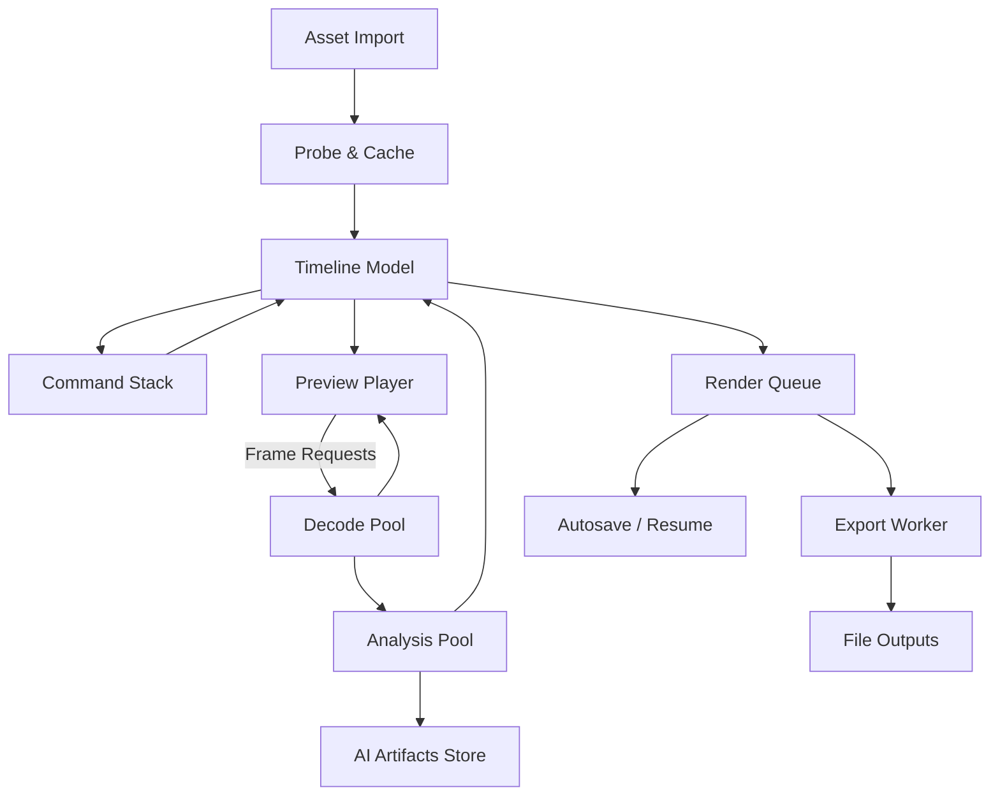

# Architecture & Project Plan

## 1. High-Level View
- Layered stack: JavaFX UI -> Application Services -> Processing Pipelines -> Engines (Media/AI) -> Storage/OS.
- Maven multi-module build enforces separation (`app-core`, `app-media`, `app-ai`, `app-ui`, `app-launcher`, upcoming `app-plugins-api` optional if required later).
- Offline-first design: no network calls by default; telemetry, model downloads, and GPU acceleration toggles are opt-in and surfaced via preferences.

## 2. Module Responsibilities
- `app-core`: domain entities, timeline model, command stack (undo/redo), autosave manager, serialization, configuration, plugin SPI (ServiceLoader), diagnostics service, telemetry toggle.
- `app-media`: JavaCV/FFmpeg integration (probe, frame cache, decode/render), export queue components, fallback messaging when codecs missing.
- `app-ai`: wraps OpenCV, ONNX Runtime, Vosk; provides scene detection, silence trimming, summarization, highlight scoring, tracking; exposes GPU capability detection per backend.
- `app-ui`: JavaFX views/controllers, timeline interaction, drag/drop, hotkeys, theming (light/dark/high-contrast), Diagnostics window, telemetry prompt, plugin UI hooks, localized resources.
- `app-launcher`: bootstrap, CLI parsing (optional), logging initialization, JFR profile flag injection, jpackage entry point.
- Future `plugins/*`: load third-party effects/exporters via ServiceLoader exposing extension interfaces defined in `app-core`.

## 3. Package Mapping
```
app.Main (launcher)
app.ui.* (JavaFX views/controllers, theme manager, diagnostics, timeline)
app.domain.* (Project, Clip, Track, Effect, Command)
app.timeline.* (editing engine, snapping, ripple logic)
app.pipeline.* (DAG scheduler, task nodes)
app.media.* (probe, cache, frame, export, ingest)
app.ai.* (scene detect, stt, highlight, gpu)
app.io.* (project persistence, autosave, template handling)
app.plugins.* (SPI definitions, manager)
app.util.* (config, logging, i18n, telemetry storage)
```

## 4. Processing & Threading Plan
- **UI Thread**: JavaFX Application Thread; timeline interactions, preview rendering requested via `AnimationTimer` / `Platform.runLater`.
- **Decode Pool** (`ExecutorService` size min(4, cores)): frame decode, audio demux; uses back-pressure queue capped by proxy cache thresholds.
- **Analysis Pool** (`ForkJoinPool` custom): AI-heavy tasks (scene detect, STT, tracking). Supports priority tasks (UI-triggered) vs background indexing. GPU tasks dispatched only when toggle enabled and hardware detected.
- **Edit Command Executor** (single thread): timeline state mutations to maintain determinism; command pattern handles undo/redo.
- **Render Queue Executor** (configurable, default 2 workers): processes DAG tasks for exports/highlight renders; supports cancellation tokens.
- **Autosave Scheduler**: `ScheduledExecutorService`; flushes project snapshots every 60s, writes crash recovery state.
- **Telemetry & Diagnostics**: background thread writes anonymized local metrics when user opts in; disabled otherwise.
- **JFR Profiling**: launcher accepts `--profile` flag enabling `-XX:StartFlightRecording` with predefined template.

## 5. Pipeline Diagram (Conceptual)


## 6. Storage Strategy
- Projects stored under `%USERPROFILE%/MontageProjects` or `~/MontageProjects`; autosave snapshots and crash recovery adjacent to main project JSON.
- Cache/proxy directories default to project path but override via preferences.
- AI artifacts (models, transcripts) under `%USERPROFILE%/MontageModels`; validated checksums before load.
- Logs under platform-specific application data (`AppData/Local/Montage/logs` on Win, `~/Library/Logs/Montage` on macOS, `~/.local/share/Montage/logs` on Linux) with rotation (size/time-based).

## 7. Diagnostics & Observability
- Central `DiagnosticsService` collects: app version, Java version, GPU support, FFmpeg availability, plugin list, telemetry status.
- Logback configuration: module-specific loggers (`app.ui`, `app.media`, etc.), console + rolling file appenders.
- Metrics/perf: render queue records timings; optional flight recording triggered by CLI/Preferences.
- Telemetry: local-only JSON stats with ability to export; disabled until user enables.

## 8. Plugin & Extension Model
- SPI interfaces in `app.plugins.api` (effect processors, export formats, AI analyzers).
- `PluginManager` (app-core) discovers service implementations via `ServiceLoader`, isolates classloaders, and exposes capability metadata to UI.
- Plugin sandbox guidelines: only file-level access granted by default; potential future policy enforcement.

## 9. Project Plan & Milestones
- Continue gate-by-gate per master summary; each gate adds tests (unit + integration + TestFX) and updates docs.
- CI pipeline: `mvn -B verify` (unit + integration), `mvn -Pheadless -pl app-ui test` for TestFX with Monocle, packaging via `mvn -Ppackage-all package` (Section 10).
- Distribution: `dist/` contains installers, README, checksum manifest.

## 10. Risks & Mitigations
- **Performance bottlenecks**: fallback to proxy resolution, adjustable thread counts, JFR templates for profiling.
- **Dependency licensing**: maintain NOTICE and Third-Party list; automated reports via license plugin.
- **Hardware variance**: GPU support optional; provide clear messaging when unavailable.
- **FFmpeg absence**: instruct to install or auto-download JavaCV bundle; show guided toast/diagnostics entry.
- **Plugin safety**: start with whitelisted classpath; document guidelines and DoD around plugin testing.

